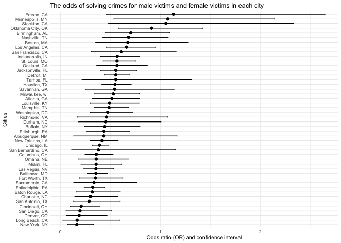
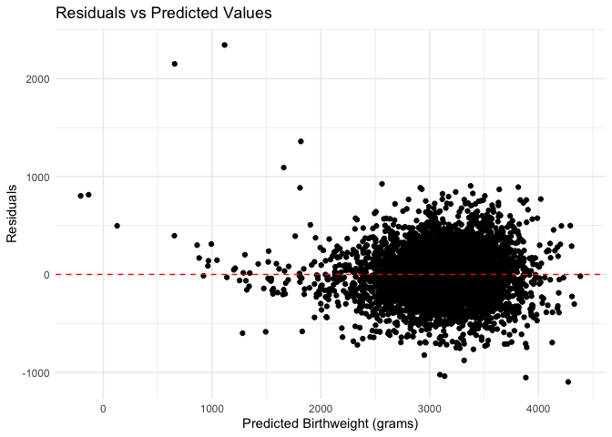

p8105_hw6_mz3084
================
Meitong Zhou
2024-11-30

``` r
library(tidyverse)
```

    ## ── Attaching core tidyverse packages ──────────────────────── tidyverse 2.0.0 ──
    ## ✔ dplyr     1.1.4     ✔ readr     2.1.5
    ## ✔ forcats   1.0.0     ✔ stringr   1.5.1
    ## ✔ ggplot2   3.5.1     ✔ tibble    3.2.1
    ## ✔ lubridate 1.9.3     ✔ tidyr     1.3.1
    ## ✔ purrr     1.0.2     
    ## ── Conflicts ────────────────────────────────────────── tidyverse_conflicts() ──
    ## ✖ dplyr::filter() masks stats::filter()
    ## ✖ dplyr::lag()    masks stats::lag()
    ## ℹ Use the conflicted package (<http://conflicted.r-lib.org/>) to force all conflicts to become errors

``` r
library(rnoaa)
```

    ## The rnoaa package will soon be retired and archived because the underlying APIs have changed dramatically. The package currently works but does not pull the most recent data in all cases. A noaaWeather package is planned as a replacement but the functions will not be interchangeable.

``` r
library(broom)
library(modelr)
```

    ## 
    ## Attaching package: 'modelr'
    ## 
    ## The following object is masked from 'package:broom':
    ## 
    ##     bootstrap

Question 1

``` r
weather_df = 
  rnoaa::meteo_pull_monitors(
    c("USW00094728"),
    var = c("PRCP", "TMIN", "TMAX"), 
    date_min = "2017-01-01",
    date_max = "2017-12-31") %>%
  mutate(
    name = recode(id, USW00094728 = "CentralPark_NY"),
    tmin = tmin / 10,
    tmax = tmax / 10) %>%
  select(name, id, everything())
```

    ## using cached file: /Users/meitongzhou/Library/Caches/org.R-project.R/R/rnoaa/noaa_ghcnd/USW00094728.dly

    ## date created (size, mb): 2024-09-26 10:05:27.238628 (8.651)

    ## file min/max dates: 1869-01-01 / 2024-09-30

``` r
bootstrap_function = function(data, n_bootstrap = 5000) {
  r_squared_values = numeric(n_bootstrap)
  log_beta_product_values = numeric(n_bootstrap)
  
  for (i in 1:n_bootstrap) {
    # sample with replacement from the data and use nrow(data) to get the total number of rows
    boot_sample = data |>
      slice_sample(n = nrow(data), replace = TRUE)
    
    # do the regression
    model = lm(tmax ~ tmin, data = boot_sample)
    
    # get R^2
    r_squared_values[i] = glance(model)$r.squared
    
    # get β0 和 β1
    beta_coefficients = coef(model)
    beta_0 = beta_coefficients[1]
    beta_1 = beta_coefficients[2]
    
    # get log(β0 * β1)
    log_beta_product_values[i] = log(abs(beta_0 * beta_1))
  }
  
  return(list(r_squared = r_squared_values, log_beta_product = log_beta_product_values))
}
```

``` r
set.seed(123) # make sure that the result gonne be repeated
bootstrap_results = bootstrap_function(weather_df)

# get the result
r_squared_values = bootstrap_results$r_squared
log_beta_product_values = bootstrap_results$log_beta_product

# get the confidence intervel
r_squared_ci = quantile(r_squared_values, probs = c(0.025, 0.975))
log_beta_product_ci = quantile(log_beta_product_values, probs = c(0.025, 0.975))

print(paste("R-squared 95% CI:", paste(round(r_squared_ci, 3), collapse = " - ")))
```

    ## [1] "R-squared 95% CI: 0.895 - 0.927"

``` r
print(paste("log(β0 * β1) 95% CI:", paste(round(log_beta_product_ci, 3), collapse = " - ")))
```

    ## [1] "log(β0 * β1) 95% CI: 1.964 - 2.058"

``` r
# distribution plot
# R-squared distribution
ggplot(data.frame(r_squared = r_squared_values), aes(x = r_squared)) +
  geom_histogram(binwidth = 0.01, fill = "blue", color = "black", alpha = 0.7) +
  theme_minimal() +
  labs(title = "Bootstrap Distribution of R-squared", x = "R-squared", y = "Frequency")
```

<!-- -->

``` r
# log(β0 * β1) dist
ggplot(data.frame(log_beta_product = log_beta_product_values), aes(x = log_beta_product)) +
  geom_histogram(binwidth = 0.05, fill = "red", color = "black", alpha = 0.7) +
  theme_minimal() +
  labs(title = "Bootstrap Distribution of log(β0 * β1)", x = "log(β0 * β1)", y = "Frequency")
```

<!-- -->
R^2: The distribution of R^2 is concentrated between about 0.89 and
0.93, with a peak near 0.91. Since R^2 is close to 1, it shows that the
linear relationship between the independent variable and the dependent
variable fits very well.

log(β0 \* β1): The distribution of log(β0 \* β1) is concentrated between
1.96 and 2.05, with a peak near 2.00,

Question 2

``` r
homicide_data = read.csv("homicide-data (1).csv")
head(homicide_data)
```

    ##          uid reported_date victim_last victim_first victim_race victim_age
    ## 1 Alb-000001      20100504      GARCIA         JUAN    Hispanic         78
    ## 2 Alb-000002      20100216     MONTOYA      CAMERON    Hispanic         17
    ## 3 Alb-000003      20100601 SATTERFIELD      VIVIANA       White         15
    ## 4 Alb-000004      20100101    MENDIOLA       CARLOS    Hispanic         32
    ## 5 Alb-000005      20100102        MULA       VIVIAN       White         72
    ## 6 Alb-000006      20100126        BOOK    GERALDINE       White         91
    ##   victim_sex        city state      lat       lon           disposition
    ## 1       Male Albuquerque    NM 35.09579 -106.5386 Closed without arrest
    ## 2       Male Albuquerque    NM 35.05681 -106.7153      Closed by arrest
    ## 3     Female Albuquerque    NM 35.08609 -106.6956 Closed without arrest
    ## 4       Male Albuquerque    NM 35.07849 -106.5561      Closed by arrest
    ## 5     Female Albuquerque    NM 35.13036 -106.5810 Closed without arrest
    ## 6     Female Albuquerque    NM 35.15111 -106.5378        Open/No arrest

``` r
# change disposition into dummy variable resolved
homicide_data = homicide_data |>
  mutate(resolved = ifelse(disposition %in% c("Closed without arrest", "Closed by arrest"), 1, 0))
```

``` r
head(homicide_data)
```

    ##          uid reported_date victim_last victim_first victim_race victim_age
    ## 1 Alb-000001      20100504      GARCIA         JUAN    Hispanic         78
    ## 2 Alb-000002      20100216     MONTOYA      CAMERON    Hispanic         17
    ## 3 Alb-000003      20100601 SATTERFIELD      VIVIANA       White         15
    ## 4 Alb-000004      20100101    MENDIOLA       CARLOS    Hispanic         32
    ## 5 Alb-000005      20100102        MULA       VIVIAN       White         72
    ## 6 Alb-000006      20100126        BOOK    GERALDINE       White         91
    ##   victim_sex        city state      lat       lon           disposition
    ## 1       Male Albuquerque    NM 35.09579 -106.5386 Closed without arrest
    ## 2       Male Albuquerque    NM 35.05681 -106.7153      Closed by arrest
    ## 3     Female Albuquerque    NM 35.08609 -106.6956 Closed without arrest
    ## 4       Male Albuquerque    NM 35.07849 -106.5561      Closed by arrest
    ## 5     Female Albuquerque    NM 35.13036 -106.5810 Closed without arrest
    ## 6     Female Albuquerque    NM 35.15111 -106.5378        Open/No arrest
    ##   resolved
    ## 1        1
    ## 2        1
    ## 3        1
    ## 4        1
    ## 5        1
    ## 6        0

``` r
# Create city_state variable and clean data
homicide_data = homicide_data |>
  filter(victim_race %in% c("White", "Black")) |>  
  filter(!city %in% c("Dallas", "Tulsa")) |>     
  mutate(victim_age = as.numeric(victim_age),       
         city_state = paste(city, state, sep = ", ")) 
```

    ## Warning: There was 1 warning in `mutate()`.
    ## ℹ In argument: `victim_age = as.numeric(victim_age)`.
    ## Caused by warning:
    ## ! NAs introduced by coercion

``` r
# Filter for Baltimore, MD
baltimore_data = homicide_data |>
  filter(city_state == "Baltimore, MD")
```

``` r
# Fit logistic regression model
model_baltimore = glm(resolved ~ victim_age + victim_sex + victim_race, 
                       data = baltimore_data, 
                       family = binomial)
summary_baltimore = broom::tidy(model_baltimore, exponentiate = TRUE, conf.int = TRUE)


print(summary_baltimore)
```

    ## # A tibble: 4 × 7
    ##   term             estimate std.error statistic  p.value conf.low conf.high
    ##   <chr>               <dbl>     <dbl>     <dbl>    <dbl>    <dbl>     <dbl>
    ## 1 (Intercept)         1.94    0.174        3.80 1.42e- 4    1.38      2.74 
    ## 2 victim_age          0.995   0.00325     -1.60 1.10e- 1    0.988     1.00 
    ## 3 victim_sexMale      0.355   0.143       -7.26 3.74e-13    0.267     0.468
    ## 4 victim_raceWhite    2.46    0.180        4.99 6.04e- 7    1.73      3.52

``` r
nested_data = homicide_data %>%
  group_by(city_state) %>%
  nest()

print(nested_data) 
```

    ## # A tibble: 46 × 2
    ## # Groups:   city_state [46]
    ##    city_state      data                 
    ##    <chr>           <list>               
    ##  1 Albuquerque, NM <tibble [178 × 13]>  
    ##  2 Atlanta, GA     <tibble [945 × 13]>  
    ##  3 Baltimore, MD   <tibble [2,753 × 13]>
    ##  4 Baton Rouge, LA <tibble [410 × 13]>  
    ##  5 Birmingham, AL  <tibble [771 × 13]>  
    ##  6 Boston, MA      <tibble [492 × 13]>  
    ##  7 Buffalo, NY     <tibble [479 × 13]>  
    ##  8 Charlotte, NC   <tibble [584 × 13]>  
    ##  9 Chicago, IL     <tibble [4,507 × 13]>
    ## 10 Cincinnati, OH  <tibble [679 × 13]>  
    ## # ℹ 36 more rows

``` r
nested_data = nested_data |>
  mutate(
    data = map(data, ~filter(.x, !is.na(victim_age) & !is.na(victim_sex) & !is.na(victim_race)))
  )
```

``` r
city_models = nested_data |>
  mutate(
    model = map(data, ~glm(resolved ~ victim_age + victim_sex + victim_race, 
                           data = .x, family = binomial)),
    results = map(model, ~broom::tidy(.x, exponentiate = TRUE, conf.int = TRUE))
  ) |>
  unnest(results)
```

    ## Warning: There were 43 warnings in `mutate()`.
    ## The first warning was:
    ## ℹ In argument: `results = map(model, ~broom::tidy(.x, exponentiate = TRUE,
    ##   conf.int = TRUE))`.
    ## ℹ In group 1: `city_state = "Albuquerque, NM"`.
    ## Caused by warning:
    ## ! glm.fit: fitted probabilities numerically 0 or 1 occurred
    ## ℹ Run `dplyr::last_dplyr_warnings()` to see the 42 remaining warnings.

``` r
odds_ratios = city_models |>
  filter(term == "victim_sexMale") |>
  select(city_state, estimate, conf.low, conf.high)

# plot
ggplot(odds_ratios, aes(x = reorder(city_state, estimate), y = estimate)) +
  geom_point() +
  geom_errorbar(aes(ymin = conf.low, ymax = conf.high), width = 0.2) +
  coord_flip() +
  labs(title = "The odds of solving crimes for male victims and female victims in each city",
       x = "Cities",
       y = "Odds ratio (OR) and confidence interval") +
  theme_minimal(base_size = 8) 
```

<!-- -->

``` r
library(dplyr)
```

``` r
odds_ratios = odds_ratios |> 
  arrange(desc(estimate))
head(odds_ratios)
```

    ## # A tibble: 6 × 4
    ## # Groups:   city_state [6]
    ##   city_state        estimate conf.low conf.high
    ##   <chr>                <dbl>    <dbl>     <dbl>
    ## 1 Fresno, CA           1.13     0.454      2.65
    ## 2 Minneapolis, MN      1.08     0.533      2.14
    ## 3 Stockton, CA         1.05     0.480      2.33
    ## 4 Oklahoma City, OK    0.909    0.578      1.42
    ## 5 Birmingham, AL       0.704    0.444      1.09
    ## 6 Nashville, TN        0.682    0.419      1.08

Fresno, CA has the highest OR (1.13), indicating that the odds of
solving crimes are relatively higher for male victims compared to female
victims. However, the confidence interval (0.45–2.65) crosses 1,
suggesting that this result is not statistically significant. Similar
trends are observed in Minneapolis, MN and Stockton, CA, where OR values
exceed 1, but wide confidence intervals reduce confidence in the
estimates.

Question 3

``` r
birthweight = read.csv("birthweight.csv")
head(birthweight)
```

    ##   babysex bhead blength  bwt delwt fincome frace gaweeks malform menarche
    ## 1       2    34      51 3629   177      35     1    39.9       0       13
    ## 2       1    34      48 3062   156      65     2    25.9       0       14
    ## 3       2    36      50 3345   148      85     1    39.9       0       12
    ## 4       1    34      52 3062   157      55     1    40.0       0       14
    ## 5       2    34      52 3374   156       5     1    41.6       0       13
    ## 6       1    33      52 3374   129      55     1    40.7       0       12
    ##   mheight momage mrace parity pnumlbw pnumsga    ppbmi ppwt smoken wtgain
    ## 1      63     36     1      3       0       0 26.27184  148      0     29
    ## 2      65     25     2      0       0       0 21.34485  128      0     28
    ## 3      64     29     1      0       0       0 23.56517  137      1     11
    ## 4      64     18     1      0       0       0 21.84508  127     10     30
    ## 5      66     20     1      0       0       0 21.02642  130      1     26
    ## 6      66     23     1      0       0       0 18.60030  115      0     14

``` r
birthweight = read.csv("birthweight.csv")


birthweight = birthweight |>
  mutate(
    babysex = factor(babysex, levels = c(1, 2), labels = c("Male", "Female")),
    mrace = factor(mrace),
    frace = factor(frace),
    malform = factor(malform),
    smoken = as.numeric(smoken)
  )


summary(birthweight)
```

    ##    babysex         bhead          blength           bwt           delwt      
    ##  Male  :2230   Min.   :21.00   Min.   :20.00   Min.   : 595   Min.   : 86.0  
    ##  Female:2112   1st Qu.:33.00   1st Qu.:48.00   1st Qu.:2807   1st Qu.:131.0  
    ##                Median :34.00   Median :50.00   Median :3132   Median :143.0  
    ##                Mean   :33.65   Mean   :49.75   Mean   :3114   Mean   :145.6  
    ##                3rd Qu.:35.00   3rd Qu.:51.00   3rd Qu.:3459   3rd Qu.:157.0  
    ##                Max.   :41.00   Max.   :63.00   Max.   :4791   Max.   :334.0  
    ##     fincome      frace       gaweeks      malform     menarche    
    ##  Min.   : 0.00   1:2123   Min.   :17.70   0:4327   Min.   : 0.00  
    ##  1st Qu.:25.00   2:1911   1st Qu.:38.30   1:  15   1st Qu.:12.00  
    ##  Median :35.00   3:  46   Median :39.90            Median :12.00  
    ##  Mean   :44.11   4: 248   Mean   :39.43            Mean   :12.51  
    ##  3rd Qu.:65.00   8:  14   3rd Qu.:41.10            3rd Qu.:13.00  
    ##  Max.   :96.00            Max.   :51.30            Max.   :19.00  
    ##     mheight          momage     mrace        parity            pnumlbw 
    ##  Min.   :48.00   Min.   :12.0   1:2147   Min.   :0.000000   Min.   :0  
    ##  1st Qu.:62.00   1st Qu.:18.0   2:1909   1st Qu.:0.000000   1st Qu.:0  
    ##  Median :63.00   Median :20.0   3:  43   Median :0.000000   Median :0  
    ##  Mean   :63.49   Mean   :20.3   4: 243   Mean   :0.002303   Mean   :0  
    ##  3rd Qu.:65.00   3rd Qu.:22.0            3rd Qu.:0.000000   3rd Qu.:0  
    ##  Max.   :77.00   Max.   :44.0            Max.   :6.000000   Max.   :0  
    ##     pnumsga      ppbmi            ppwt           smoken           wtgain      
    ##  Min.   :0   Min.   :13.07   Min.   : 70.0   Min.   : 0.000   Min.   :-46.00  
    ##  1st Qu.:0   1st Qu.:19.53   1st Qu.:110.0   1st Qu.: 0.000   1st Qu.: 15.00  
    ##  Median :0   Median :21.03   Median :120.0   Median : 0.000   Median : 22.00  
    ##  Mean   :0   Mean   :21.57   Mean   :123.5   Mean   : 4.145   Mean   : 22.08  
    ##  3rd Qu.:0   3rd Qu.:22.91   3rd Qu.:134.0   3rd Qu.: 5.000   3rd Qu.: 28.00  
    ##  Max.   :0   Max.   :46.10   Max.   :287.0   Max.   :60.000   Max.   : 89.00

``` r
birthweight = birthweight |>
  drop_na()
```

``` r
# use all variable to make the linear regression
model_full = lm(bwt ~ ., data = birthweight)
summary(model_full)
```

    ## 
    ## Call:
    ## lm(formula = bwt ~ ., data = birthweight)
    ## 
    ## Residuals:
    ##      Min       1Q   Median       3Q      Max 
    ## -1097.68  -184.86    -3.33   173.09  2344.15 
    ## 
    ## Coefficients: (3 not defined because of singularities)
    ##                 Estimate Std. Error t value Pr(>|t|)    
    ## (Intercept)   -6265.3914   660.4011  -9.487  < 2e-16 ***
    ## babysexFemale    28.7073     8.4652   3.391 0.000702 ***
    ## bhead           130.7781     3.4523  37.881  < 2e-16 ***
    ## blength          74.9536     2.0217  37.075  < 2e-16 ***
    ## delwt             4.1007     0.3948  10.386  < 2e-16 ***
    ## fincome           0.2898     0.1795   1.614 0.106551    
    ## frace2           14.3313    46.1501   0.311 0.756168    
    ## frace3           21.2361    69.2960   0.306 0.759273    
    ## frace4          -46.9962    44.6782  -1.052 0.292912    
    ## frace8            4.2969    74.0741   0.058 0.953745    
    ## gaweeks          11.5494     1.4654   7.882 4.06e-15 ***
    ## malform1          9.7650    70.6259   0.138 0.890039    
    ## menarche         -3.5508     2.8951  -1.226 0.220083    
    ## mheight           9.7874    10.3116   0.949 0.342588    
    ## momage            0.7593     1.2221   0.621 0.534418    
    ## mrace2         -151.4354    46.0453  -3.289 0.001014 ** 
    ## mrace3          -91.3866    71.9190  -1.271 0.203908    
    ## mrace4          -56.4787    45.1369  -1.251 0.210901    
    ## parity           95.5411    40.4793   2.360 0.018307 *  
    ## pnumlbw               NA         NA      NA       NA    
    ## pnumsga               NA         NA      NA       NA    
    ## ppbmi             4.3538    14.8913   0.292 0.770017    
    ## ppwt             -3.4716     2.6121  -1.329 0.183913    
    ## smoken           -4.8544     0.5871  -8.269  < 2e-16 ***
    ## wtgain                NA         NA      NA       NA    
    ## ---
    ## Signif. codes:  0 '***' 0.001 '**' 0.01 '*' 0.05 '.' 0.1 ' ' 1
    ## 
    ## Residual standard error: 272.5 on 4320 degrees of freedom
    ## Multiple R-squared:  0.7183, Adjusted R-squared:  0.717 
    ## F-statistic: 524.6 on 21 and 4320 DF,  p-value: < 2.2e-16

``` r
#  birth and gestational age
model_simple = lm(bwt ~ blength + gaweeks, data = birthweight)
summary(model_simple)
```

    ## 
    ## Call:
    ## lm(formula = bwt ~ blength + gaweeks, data = birthweight)
    ## 
    ## Residuals:
    ##     Min      1Q  Median      3Q     Max 
    ## -1709.6  -215.4   -11.4   208.2  4188.8 
    ## 
    ## Coefficients:
    ##              Estimate Std. Error t value Pr(>|t|)    
    ## (Intercept) -4347.667     97.958  -44.38   <2e-16 ***
    ## blength       128.556      1.990   64.60   <2e-16 ***
    ## gaweeks        27.047      1.718   15.74   <2e-16 ***
    ## ---
    ## Signif. codes:  0 '***' 0.001 '**' 0.01 '*' 0.05 '.' 0.1 ' ' 1
    ## 
    ## Residual standard error: 333.2 on 4339 degrees of freedom
    ## Multiple R-squared:  0.5769, Adjusted R-squared:  0.5767 
    ## F-statistic:  2958 on 2 and 4339 DF,  p-value: < 2.2e-16

``` r
# head circumference, length, sex, and all interactions
model_interactions = lm(bwt ~ bhead * blength * babysex, data = birthweight)
summary(model_interactions)
```

    ## 
    ## Call:
    ## lm(formula = bwt ~ bhead * blength * babysex, data = birthweight)
    ## 
    ## Residuals:
    ##      Min       1Q   Median       3Q      Max 
    ## -1132.99  -190.42   -10.33   178.63  2617.96 
    ## 
    ## Coefficients:
    ##                               Estimate Std. Error t value Pr(>|t|)    
    ## (Intercept)                 -7176.8170  1264.8397  -5.674 1.49e-08 ***
    ## bhead                         181.7956    38.0542   4.777 1.84e-06 ***
    ## blength                       102.1269    26.2118   3.896 9.92e-05 ***
    ## babysexFemale                6374.8684  1677.7669   3.800 0.000147 ***
    ## bhead:blength                  -0.5536     0.7802  -0.710 0.478012    
    ## bhead:babysexFemale          -198.3932    51.0917  -3.883 0.000105 ***
    ## blength:babysexFemale        -123.7729    35.1185  -3.524 0.000429 ***
    ## bhead:blength:babysexFemale     3.8781     1.0566   3.670 0.000245 ***
    ## ---
    ## Signif. codes:  0 '***' 0.001 '**' 0.01 '*' 0.05 '.' 0.1 ' ' 1
    ## 
    ## Residual standard error: 287.7 on 4334 degrees of freedom
    ## Multiple R-squared:  0.6849, Adjusted R-squared:  0.6844 
    ## F-statistic:  1346 on 7 and 4334 DF,  p-value: < 2.2e-16

``` r
cross_validate = function(data, n_splits = 5) {
  set.seed(123)  
  results = map(1:n_splits, ~{
    
    train_index = sample(1:nrow(data), size = 0.8 * nrow(data))
    train_data = data[train_index, ]
    test_data = data[-train_index, ]
    

    full_model = lm(bwt ~ ., data = train_data)
    simple_model = lm(bwt ~ blength + gaweeks, data = train_data)
    interactions_model = lm(bwt ~ bhead * blength * babysex, data = train_data)
    
    # get MSE
    full_mse = mean((test_data$bwt - predict(full_model, newdata = test_data))^2)
    simple_mse = mean((test_data$bwt - predict(simple_model, newdata = test_data))^2)
    interactions_mse = mean((test_data$bwt - predict(interactions_model, newdata = test_data))^2)
    
    
    list(full_mse = full_mse, simple_mse = simple_mse, interactions_mse = interactions_mse)
  })
  
  
  mse_df = map_dfr(results, ~as.data.frame(.))
  return(mse_df)
}


cv_results = cross_validate(birthweight, n_splits = 5)


cv_summary = cv_results |>
  summarise(
    full_model_mse = mean(full_mse),
    simple_model_mse = mean(simple_mse),
    interactions_model_mse = mean(interactions_mse)
  )

print(cv_summary)
```

    ##   full_model_mse simple_model_mse interactions_model_mse
    ## 1       74031.84           113167               83440.46

The full model has the lowest Mean Squared Error (MSE) at 74,031.84,
indicating it provides the most accurate predictions among the three
models.The interactions model, which includes interaction terms (bhead
\* blength \* babysex), performs better than the simple model but worse
than the full model, with an MSE of 83,440.46. The simple model, which
only uses blength and gaweeks, has the highest MSE at 113,167,
suggesting it is the least accurate.

``` r
birthweight = birthweight |>
  add_predictions(model_full) |>
  add_residuals(model_full)


ggplot(birthweight, aes(x = pred, y = resid)) +
  geom_point() +
  geom_hline(yintercept = 0, color = "red", linetype = "dashed") +
  labs(
    title = "Residuals vs Predicted Values",
    x = "Predicted Birthweight (grams)",
    y = "Residuals"
  ) +
  theme_minimal()
```

<!-- -->
The residuals are scattered around the red dashed line (y = 0), which is
desirable as it suggests that the errors are centered around
zero.However, the spread of residuals is not completely uniform across
the range of predicted birthweight values, indicating potential
heteroscedasticity.
